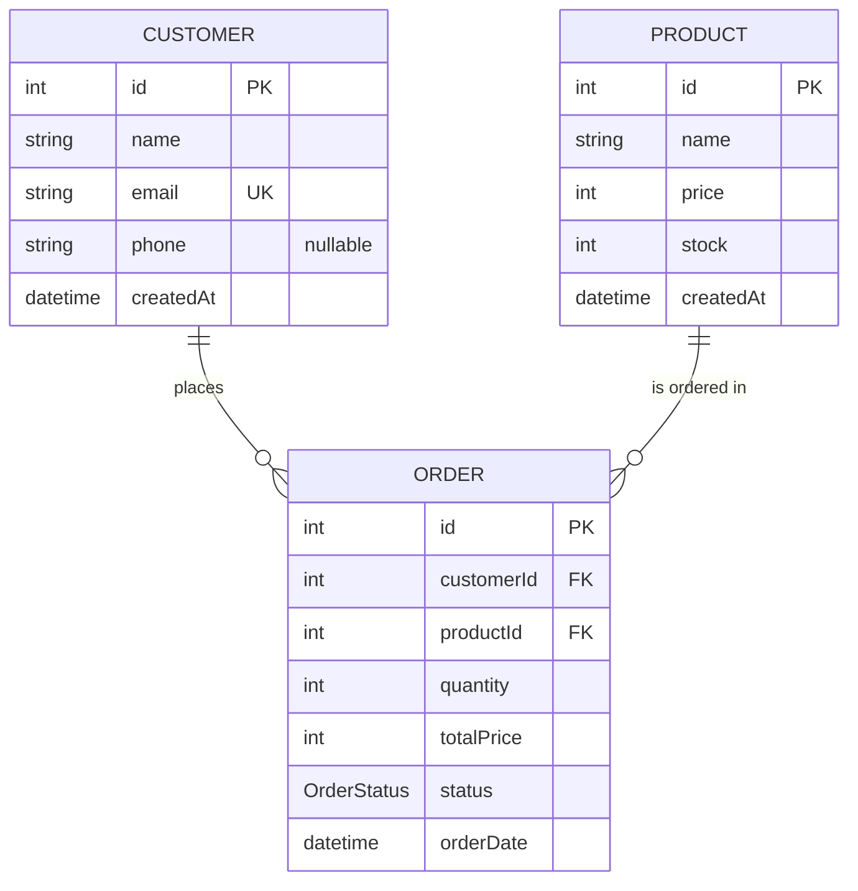

# 2. ERD & Data Dictionary

## ERD

## Data dictionary

### Customer *(already in the schema)*

| Column | Type | Constraints |
|---|---|---|
| id | Int | PK, auto-increment |
| name | String | required |
| email | String | required, **unique** |
| phone | String | optional (nullable) |
| createdAt | DateTime | default: now |
| orders | Order[] | relation: one customer has many orders |

### Product *(already in the schema)*

| Column | Type | Constraints |
|---|---|---|
| id | Int | PK, auto-increment |
| name | String | required |
| price | Int | required — price per unit in US dollars |
| stock | Int | required — units on the shelf right now |
| createdAt | DateTime | default: now |
| orders | Order[] | relation: one product has many orders |

### OrderStatus (enum) — *you create this (S5)*

| Value | Meaning |
|---|---|
| PENDING | the order is placed but not paid yet |
| PAID | the order is paid — it can no longer be cancelled |
| CANCELLED | the order was cancelled (stock restored) |

### Order — *you create this (S5)*

| Column | Type | Constraints |
|---|---|---|
| id | Int | PK, auto-increment |
| customerId | Int | FK → Customer.id, required |
| productId | Int | FK → Product.id, required |
| quantity | Int | required — number of units |
| totalPrice | Int | required — quantity × price, in US dollars |
| status | OrderStatus | required, **default: PENDING** |
| orderDate | DateTime | required, **default: now** |
| customer | Customer | relation field |
| product | Product | relation field |
